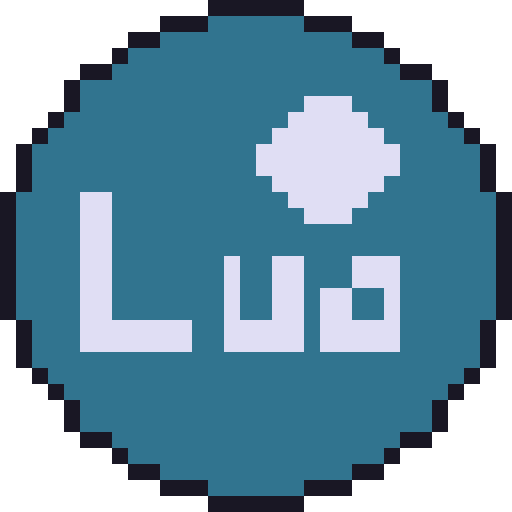
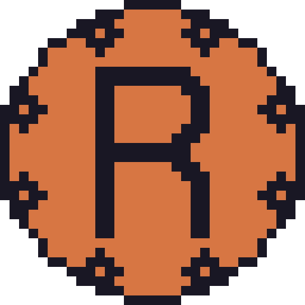
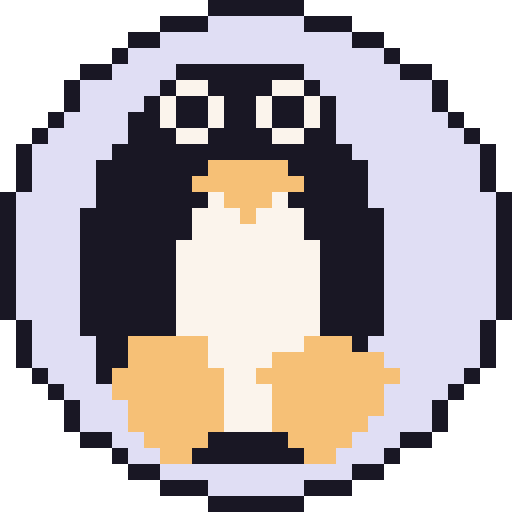
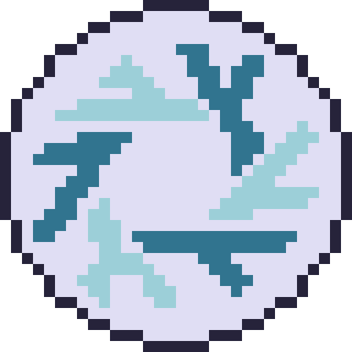
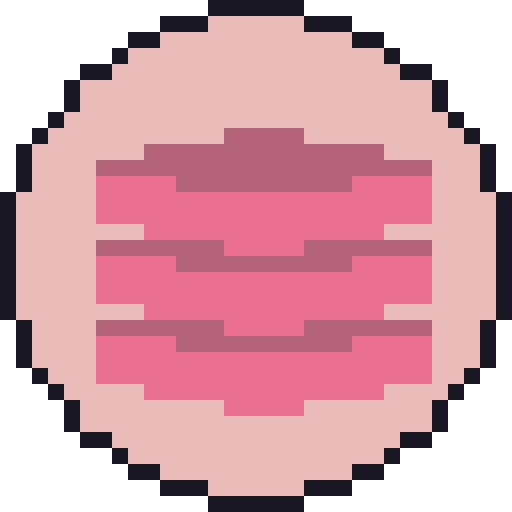
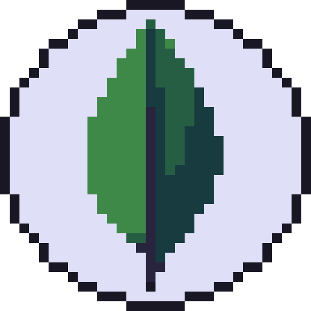

### Call me Amir

#### I'm A Project in Development Since 1993.

Hi there! As you may have already guessed, My name is Amir. I'm a back-end developer.

I'm passionate for developing software that once they work,
they work forever. Which means having some more overhead,
but less bugs and legacy.

Think of it as:

  
**static languages** -- over -> **dynamic languages**

**strong type-system** -- over -> **weak type-system** 

**immutible architecture** -- over -> **mutable systems**
  

### My Languages:

### My OSes:

_NixOS is technically a Linux distribution but,_
_it has it has a radically different way of doing things._

### My Databases 

### I'm also highly interested in these concepts 

<!--
**amirography/amirography** is a ✨ _special_ ✨ repository because its `README.md` (this file) appears on your GitHub profile.

Here are some ideas to get you started:

- 🔭 I’m currently working on ...
- 🌱 I’m currently learning ...
- 👯 I’m looking to collaborate on ...
- 🤔 I’m looking for help with ...
- 💬 Ask me about ...
- 📫 How to reach me: ...
- 😄 Pronouns: ...
- ⚡ Fun fact: ...
-->

